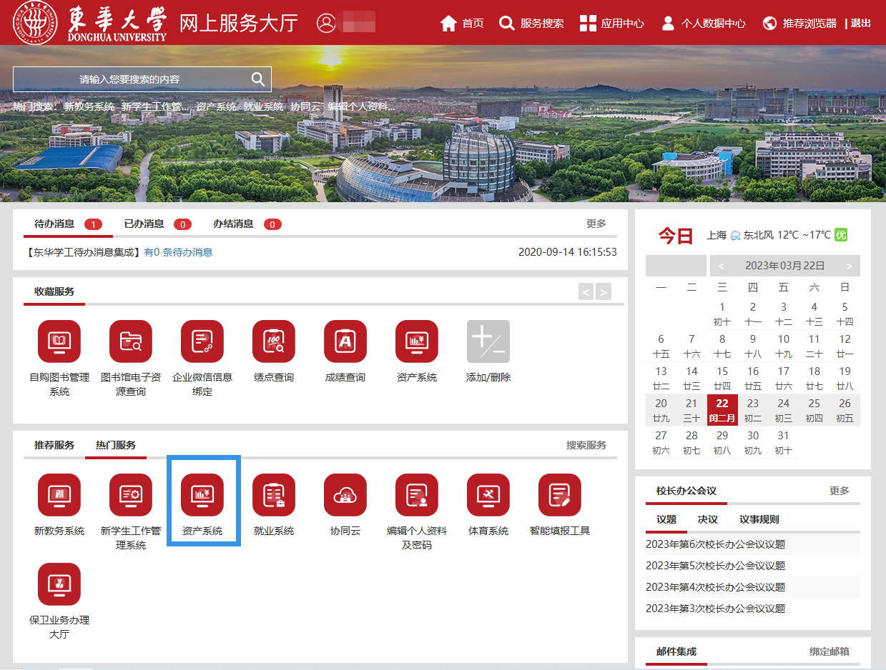
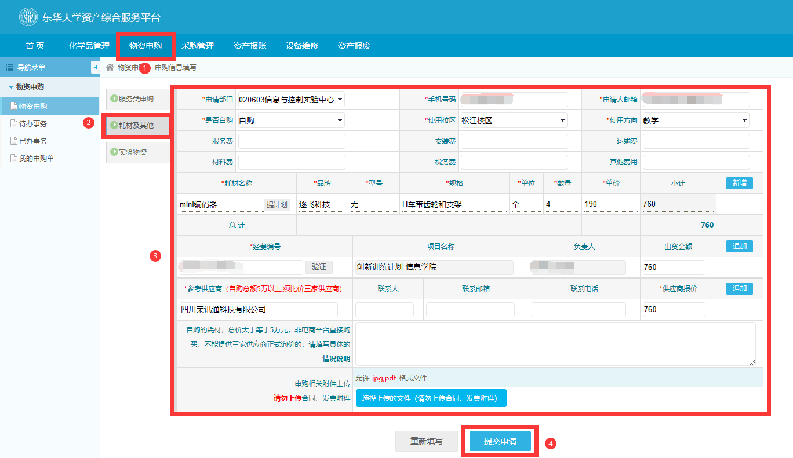
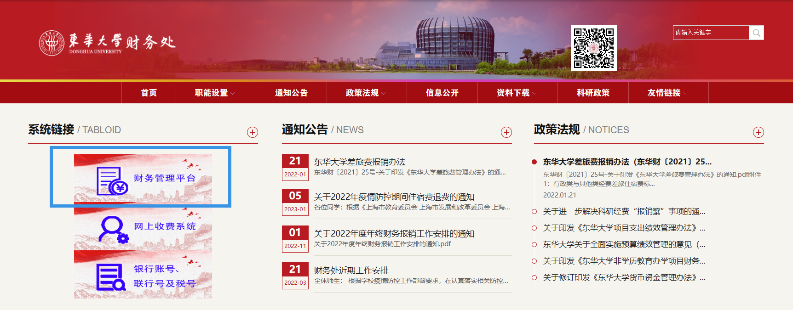
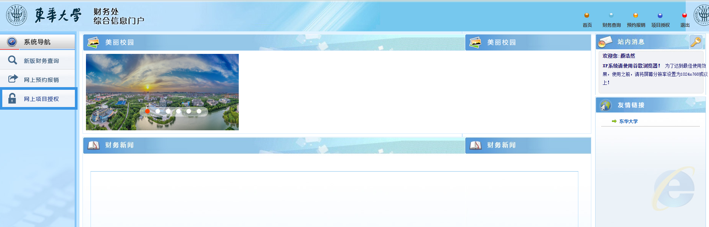
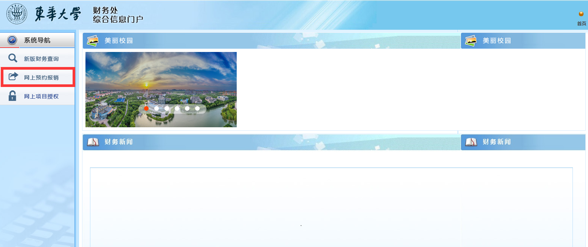

## 东华大学发票报销流程
>抬头：东华大学

>税号：12100000425006176T

电子发票和纸质发票无区别，只需要黑白打印，且一般都是走耗材报销。

金额小于**199**的发票，报销比较方便，财务处预约一下就能报销；
金额大于**199**的发票，需要进行**物资申购与审核**。

所以在开发票的时候要求商家**单价不超过200，单张发票金额不超过1000。** 
可以的话**单张发票不超过200（可以省去物资申购的流程）。**

#### 1.先通过网上服务大厅进入资产系统
[网上服务大厅链接](http://ehall.dhu.edu.cn/_web/fusionportal/dhlogin.jsp?_p=YXM9MSZwPTEmbT1OJg__)

#### 2.金额超过199的发票进行物资申购

1. 先点击物资申购；
2. 点击耗材及其他；
3. 填写申请部门、手机号码、申请人邮箱、使用校区，**是否自购**一项选择**自购**，**使用方向**选择**教学**；
4. 耗材名称根据发票内容着实填写，若没有品牌、型号、规格等信息，可填无，此处应注意耗材单价的填写，**发票金额**加上**税额**是**价税合计的金额**，若**价税合计的金额**除以**数量**后的单价可以用小数点后两位的数字表示，则**单价一栏**填写该数字，否则**数量一栏**填写1，**单价一栏**填写**价税合计的金额**；
5. **经费编号**到财务处查询，[财务处链接](https://cwc.dhu.edu.cn/)，随后点击**网上项目授权**，复制最左侧一栏**项目号**即可；
>**财务处的初始密码一般为学号**

6. **参考供应商**填写发票上**销售方的名称**，**供应商报价**和**价税合计的金额**一致即可；
7. 此时无需上传发票，若上传发票之后还需要上传一次；
8. 随后提交申请。
9. 审核完成后在首页查看

#### 3.教务处预约报销
1. 进入[财务处](https://cwc.dhu.edu.cn/)，点击**网上预约报销**

2. 点击左下角**申请报销单**